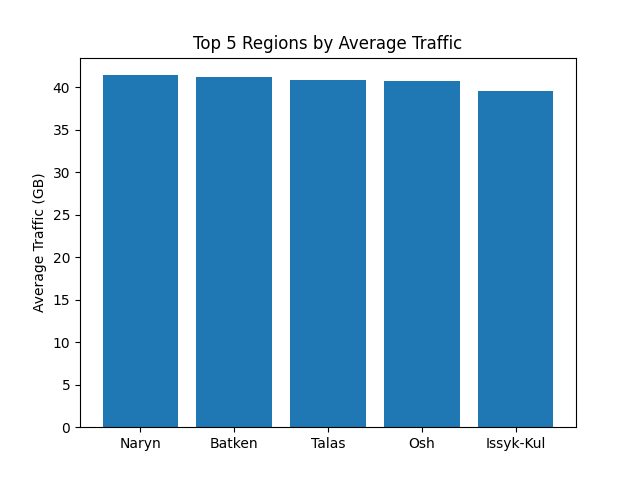
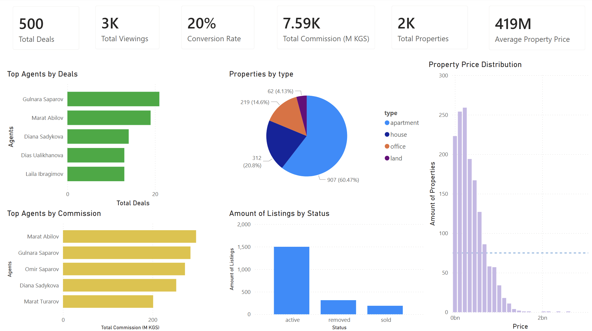

# Aigerim's Portfolio

## [Project 1: Internet Traffic Analysis](https://github.com/corydonnnn/Internet_traffic_analysis_Python)

This project was done as part of my course certification exam. This project analyzed telecom internet traffic data from different regions of Kyrgyzstan to understand user behavior across regions and tariff plans.

**Business Problem:**  
Telecom operators in Kyrgyzstan needed to understand regional internet usage patterns and identify tariff plans in which users frequently exceed usage limits.

**Skills used:** Python (pandas, matplotlib), data cleaning, data visualization, basic statistical analysis

**Project Goal:** Understand trends and usage patterns in internet traffic.

**What I accomplished:** 
- Cleaned and explored raw traffic data
- Created visualizations showing traffic trends over time
- Identified peak usage periods and anomalies

**Outcome:**  
- Highlighted regions with high traffic usage  
- Insights can help telecoms optimize plans and manage network resources  
- Reports provide data-driven recommendations for improving service and user experience

**Next Steps / Advice:** Could extend analysis with predictive modeling or compare with data from other countries for benchmarking.

## [Project 2: Real Estate Analysis](https://github.com/corydonnnn/Real_Estate_Analysis_SQL)

This project was also done as part of my course certification exam. It focused on analyzing real estate data from Bishkek, Kyrgyzstan. Prices are in Kyrgyz som (KGS). The goal was to identify pricing trends, popular property types, and market insights in the local market.

**Business Problem:**  
Real estate agencies in Bishkek, Kyrgyzstan, needed insights to improve pricing strategies, monitor agent performance, and optimize property marketing.

**Skills used:** SQL (data cleaning, queries, aggregation, window functions), Power BI (visualizations, dashboards, reporting)

**Project Goal:** Explore real estate market trends and generate actionable insights for pricing and demand.

**What I accomplished:**  
- Cleaned and structured raw property data using SQL  
- Performed queries to analyze pricing trends by location and property type  
- Built interactive dashboards in Power BI to visualize market trends  
- Identified key factors affecting property prices

**Outcome:**  
- Identified top-performing agents and high-demand property types  
- Revealed listings that never convert, helping optimize marketing and agent efforts  
- Dashboard enables the agency to monitor trends and make data-driven pricing and sales decisions

## Power BI Dashboard

*Figure: Dashboard showing pricing trends and top-performing property types*

**Next Steps / Advice:** Expand analysis with predictive analytics in Power BI or integrate external economic data for deeper insights.
